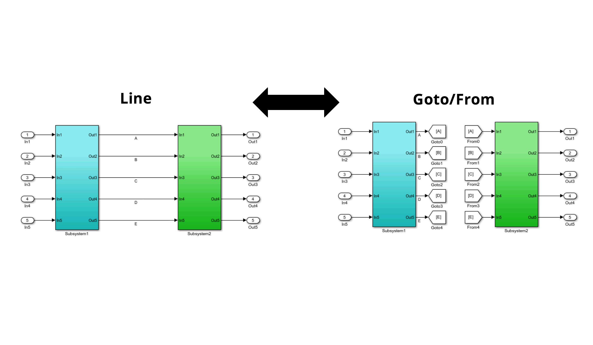

# Line - Goto/From Tool

The use of Goto/From blocks or signal lines helps to increase Simulink model readability where appropriate. In models with many signal line crossings, converting some signal lines to Goto/From blocks helps in decluttering the model. Conversely, using signal lines for straightforward connections, instead of Goto/From blocks, allows developers to more easily follow the visual data flow. The Line-Goto/From tool quickly converts signal lines to Goto/From blocks, as well as Goto/From blocks to signal lines.

## User Guide
For installation and other information, please see the [User Guide](doc/LineToGotoFrom_UserGuide.pdf).
